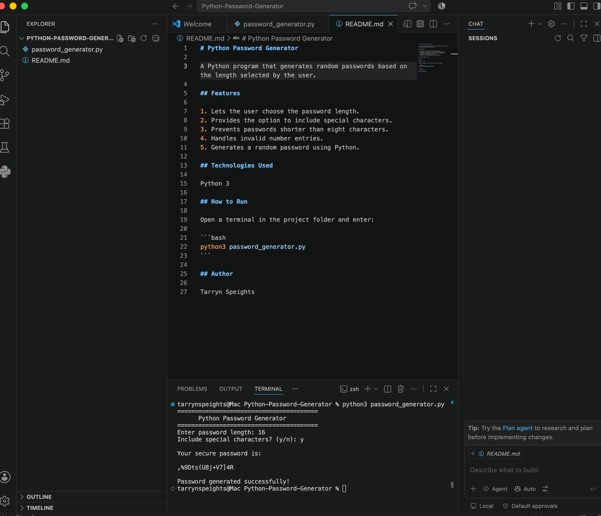

# Python Password Generator



A Python program that generates random passwords based on the length selected by the user.

## Features

1. Lets the user choose the password length.
2. Provides the option to include special characters.
3. Prevents passwords shorter than eight characters.
4. Handles invalid number entries.
5. Generates a random password using Python.

## Technologies Used

Python 3

## How to Run

Open a terminal in the project folder and enter:

```bash
python3 password_generator.py
```

## Author

Tarryn Speights
